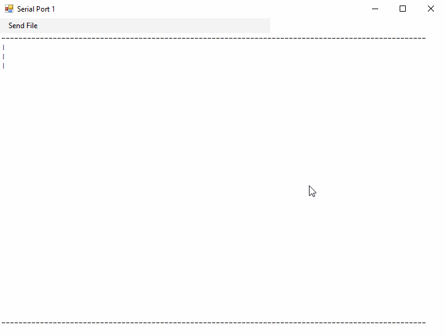
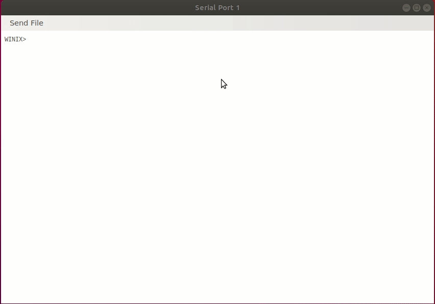
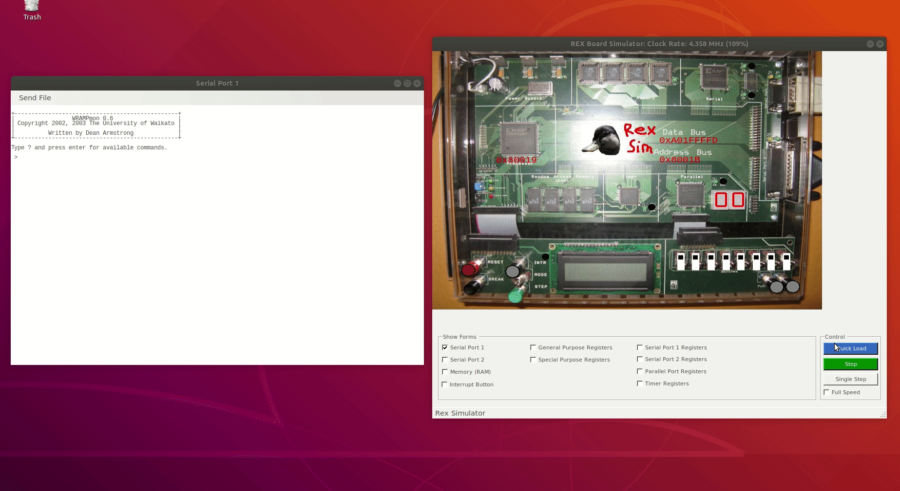

# WINIX OS

 [](https://www.gnu.org/licenses/gpl-3.0) [](https://www.codefactor.io/repository/github/halfer53/winix/overview/master)

Winix is a minimal, hobbyist, educational and UNIX-style Operating System for the Waikato RISC Architecture Microprocessor (WRAMP). It is a hybrid kernel with usability and performance in mind. Winix is mainly inspired by Minix1, which is the OS I learnt when I was in university.

Winix includes full-featured kernel with process and memory management, in-memory file system, exception control and user space bourne shell with interactive command line. Yes, you can even play snake on it by typing ```snake``` in the command line

## Demo

### Playing Snake


### Using Pipe in bash


## Features

 - Kernel Memory Management: virtual memory, page mapping
 - Process Management: Kernel thread, process creation
 - Exception control and interrupt handler
 - In-memory file system that supports most of the POSIX api
 - A Bourne shell supporting multiple pipes and redirection
 - User memory management: malloc() free()
 - User coroutine with ```ucontext.h``` support
 - Stacktrace dump, segfault analysis

## Supported Commands

 - [snake](user/commands/snake.c)
 - [bash](user/bash/bash.c)
 - [cat](user/commands/cat.c)
 - [cp](user/commands/cp.c)
 - [echo](user/commands/echo.c)
 - [grep](user/commands/grep.c)
 - [history](user/commands/history.c)
 - [ls](user/commands/ls.c)
 - [mkdir](user/commands/mkdir.c)
 - [mv](user/commands/mv.c)
 - [ps](user/commands/ps.c)
 - [pwd](user/commands/pwd.c)
 - [rm](user/commands/rm.c)
 - [stat](user/commands/stat.c)
 - [test](user/commands/test.c)
 - [touch](user/commands/touch.c)
 - [uptime](user/commands/uptime.c)
 - [wc](user/commands/wc.c)
 - [df](user/commands/df.c)
 - [du](user/commands/du.c)
 - [ln](user/commands/ln.c)

## How to Run

Download the latest Rexsimulator from [Here](https://github.com/halfer53/rexsimulator/releases)

N.B. `mono` is required to run in Linux environment, [Download Instruction](https://www.mono-project.com/download/stable/#download-lin)

Download the latest WINIX binary ```winix.srec``` from [Here](https://github.com/halfer53/winix/releases)

Run ```Rexsimulator.exe```

Click ```Quick Load```, select ```winix.srec```

### Loading Winix


## How to Compile

### Prerequisite

#### Linux / WSL 

```sudo apt-get install xutils-dev gcc```

### Clone and   Compile

```git clone https://github.com/halfer53/winix.git```

```cd winix```

```export PATH=`pwd`/tools/bin:$PATH```

```make```

## Debug tips

### Debug Makefile

Similar to linux kbuild, **Winix** supports verbose option, you can debug Makefile by setting verbose to 1

```make V=1```

### Debug Kernel

```kprintf()``` is your friend. 

```trace```: " type trace in bash to print all the syscalls in serial port 2 


## Supported System Call

 - [times](kernel/system/do_times.c#L23)
 - [exit](kernel/system/do_exit_wait.c#L249)
 - [fork](kernel/system/do_fork.c#L135)
 - [vfork](kernel/system/do_fork.c#L152)
 - [execve](kernel/system/do_execve.c#L48)
 - [brk](kernel/system/do_brk.c#L94)
 - [alarm](kernel/system/do_alarm.c#L29)
 - [sigaction](kernel/system/do_sigaction.c#L44)
 - [sigret](kernel/system/do_sigreturn.c#L19)
 - [waitpid](kernel/system/do_exit_wait.c#L36)
 - [kill](kernel/system/do_kill.c#L57)
 - [getpid](kernel/system/do_getpid.c#L20)
 - [winfo](kernel/system/do_winfo.c#L19)
 - [strerror](kernel/system/do_dprintf.c#L21)
 - [dprintf](kernel/system/do_dprintf.c#L52)
 - [sysconf](kernel/system/do_sysconf.c#L4)
 - [sigsuspend](kernel/system/do_sigsuspend.c#L18)
 - [sigpending](kernel/system/do_sigpending.c#L17)
 - [sigprocmask](kernel/system/do_sigprocmask.c#L20)
 - [setpgid](kernel/system/do_setpgid.c#L3)
 - [getpgid](kernel/system/do_getpgid.c#L4)
 - [open](fs/system/open_close.c#L119)
 - [read](fs/system/read_write.c#L28)
 - [write](fs/system/read_write.c#L35)
 - [close](fs/system/open_close.c#L137)
 - [creat](fs/system/open_close.c#L128)
 - [pipe](fs/system/pipe.c#L39)
 - [mknod](fs/system/mknod.c#L44)
 - [chdir](fs/system/chdir_mkdir.c#L68)
 - [chown](fs/system/chown_chmod.c#L11)
 - [chmod](fs/system/chown_chmod.c#L33)
 - [stat](fs/system/stat.c#L47)
 - [fstat](fs/system/stat.c#L56)
 - [dup](fs/system/dup.c#L50)
 - [dup2](fs/system/dup.c#L54)
 - [link](fs/system/link_unlink.c#L72)
 - [unlink](fs/system/link_unlink.c#L81)
 - [getdent](fs/system/getdent.c#L58)
 - [access](fs/system/umask_access.c#L38)
 - [mkdir](fs/system/chdir_mkdir.c#L75)
 - [sync](fs/system/sync.c#L6)
 - [lseek](fs/system/lseek.c#L58)
 - [umask](fs/system/umask_access.c#L14)
 - [fcntl](fs/system/fcntl.c#L26)
 - [ioctl](fs/system/ioctl.c#L15)
 - [setsid](/kernel/system/do_setsid.c#L3)
 - [csleep](kernel/system/do_csleep.c#L17)
 - [getppid](kernel/system/do_getpid.c#L25)
 - [signal](kernel/system/do_sigaction.c#L70)
 - [sbrk](kernel/system/do_brk.c#L85)
 - [statfs](fs/system/statfs.c#L43)
 - [getcwd](fs/system/getcwd.c#L4)
 - [tfork](kernel/system/do_fork.c#L172)

## Credits
[Paul Monigatti](https://nz.linkedin.com/in/paulmonigatti)
